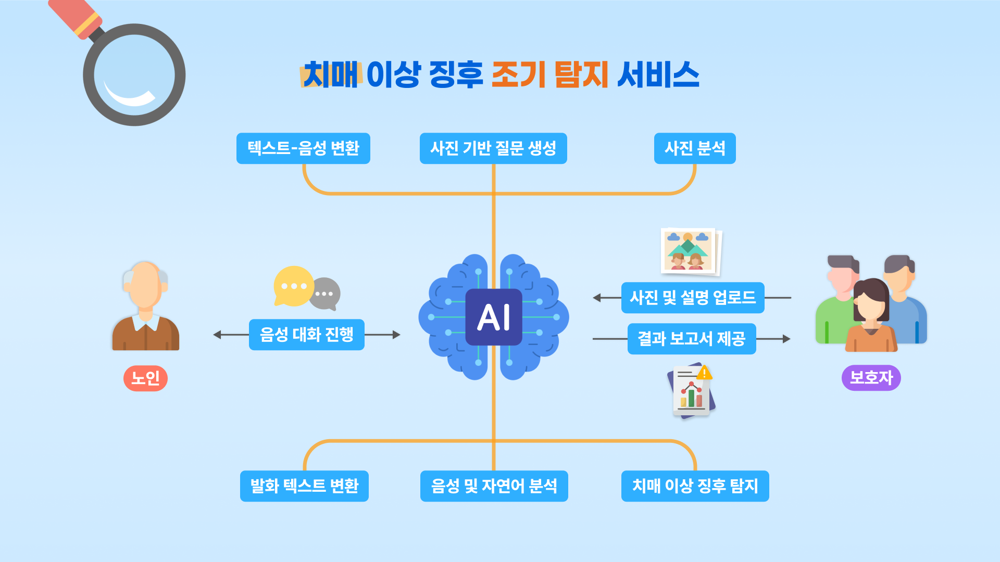

# Memento Box 🎁

## 📌 Summary

-   🎯 An **reminiscence photo-album AI chat service** that lets seniors revisit cherished memories and **detects early cognitive-decline signs to prevent dementia**.
-   🤔 **Why** we started this project?
    -   🧠 Early signs of dementia **often go unnoticed in daily life**, beyond regular medical checkups.
    -   📊 There’s no objective way to record or analyze signs of dementia **in daily life**.
    -   🚨 Dementia is hard to cure, which makes **early detection** and **prevention** crucial.
-   🚀 **How** we solved it
    -   🤖 We built an AI system that transforms **shared family memories** into meaningful conversations, while gently **monitoring cognitive health** through natural voice interactions.
    -   📤 By sharing meaningful photos and short stories, families help the AI create **personalized** questions that spark warm conversations.
    -   💬 Seniors enjoy familiar conversations with the AI, **recalling personal memories** through questions tailored to their life.
    -   📈 During these interactions, the **AI detects signs of cognitive decline** and generates reports to share with family members.

## 👀 How does it work?

  
  

## ⚙️ Architecture

  
  
  
  
  
  
  
  
  
  

## 🧑🏻‍💻 Developers

  <table align="center">
    <tr>
      <td align="center"></td>
      <td align="center"></td>
      <td align="center"></td>
      <td align="center"></td>
      <td align="center"></td>
      <td align="center"></td>
      <td align="center"></td>
    </tr>
    <tr>
      <td align="center"><a href="https://github.com/Gwona">고권아</a></td>
      <td align="center"><a href="https://github.com/suyeon0702">김수연</a></td>
      <td align="center"><a href="https://github.com/kairosial">김승연</a></td>
      <td align="center"><a href="https://github.com/walkerprocess">김현성</a></td>
      <td align="center"><a href="https://github.com/jsoo5">오지수</a></td>
      <td align="center"><a href="https://github.com/hongwon1031">윤홍원</a></td>
      <td align="center"><a href="https://github.com/Ju-hong">이주홍</a></td>
    </tr>
    <tr>
      <!-- 고권아 -->
      <td align="center" style="min-width: 220px;">
        
Team Lead

        
Audio Detection Model

        
FrontEnd Dev.

      </td>
      <!-- 김수연 -->
      <td align="center" style="min-width: 220px;">
        
FE & BE Integration

        
API Dev.

        
Prompt Engineering

      </td>
      <!-- 김승연 -->
      <td align="center" style="min-width: 220px;">
        
Product Owner

        
Architecture Design

        
BackEnd Lead

      </td>
      <!-- 김현성 -->
      <td align="center" style="min-width: 220px;">
        
Planning

        
Prompt Engineering

        
FrontEnd Dev.

      </td>
      <!-- 오지수 -->
      <td align="center" style="min-width: 220px;">
        
FrontEnd Lead

        
UI/UX Design

        
Video Prod.

      </td>
      <!-- 윤홍원 -->
      <td align="center" style="min-width: 220px;">
        
Voice Custom Model

        
FE & BE Integration

        
BackEnd Dev.

      </td>
      <!-- 이주홍 -->
      <td align="center" style="min-width: 220px;">
        
DataBase Lead

        
Server Integration

        
CI/CD

      </td>
    </tr>
  </table>

